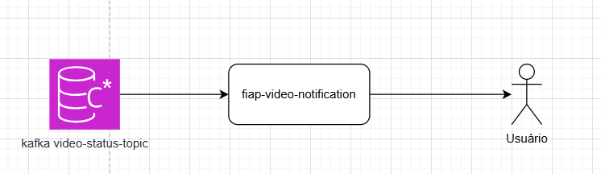

# 🎬 FIAP Video Notification

Aplicação responsável por consumir o tópico `video-status` e enviar notificações via email para os usuários conforme os status dos vídeos.

---

## 📸 Funcionamento

---

## ⚙️ Tecnologias Utilizadas

- Java 21
- Spring Boot
- Kafka
- SMTP/Email Sender
- Docker
